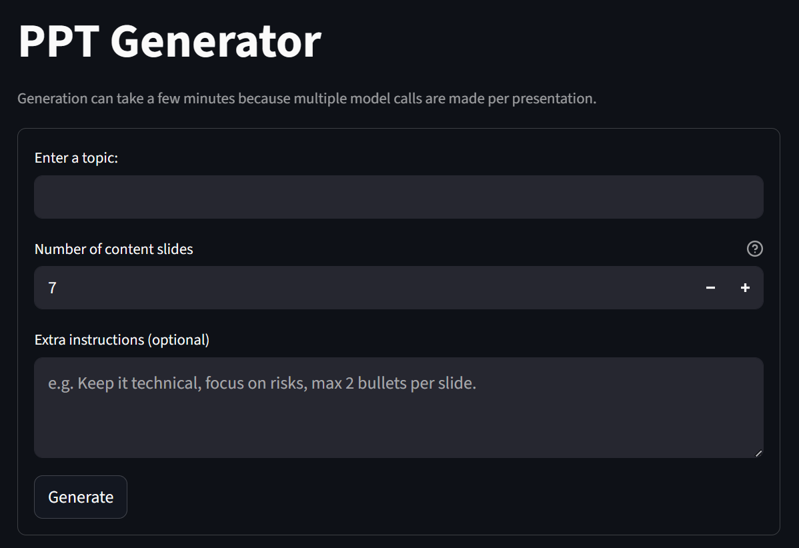

# PPT Generator

A local LLM assisted ppt generation tool



## Enhanced version

This fork by @tobitege adds a more practical, user-friendly generator flow:

- Live progress message + progress bar during generation
- Enter key submits generation (form-based UI)
- Configurable number of content slides
- Optional extra instructions field for style/constraints
- Sidebar LLM settings (provider, base URL, model, API key)
- Profile-based LLM configs (save multiple provider/model/base URL setups)
- API keys are stored encrypted per profile via OS keychain (`keyring`)
- OpenAI SDK-based provider calls with retries, timeout, and request pacing
- LM Studio and Ollama are both supported via OpenAI-compatible endpoints
- Better runtime error messages in the UI
- Helper scripts for start/stop:
  - `run-ppt-generator.ps1`
  - `stop-ppt-generator.ps1`

## Original author's message  

Writing presentations for course assignments is just boilerplate work most often, especially when even the lecturers dont even care about it.
Thats why I automated the boilerplate work, just enter a topic and the tool generates a simple presentation , enough to satisfy the base course requirement.

## Running Locally

This app supports three providers:

- `ollama`
- `lm_studio` (LM Studio v1 REST API)
- `openai_compat`

clone the repo and move into the directory

```sh
git clone https://github.com/tobitege/ppt_generator.git
cd ppt_generator
```

install dependencies with `uv` (recommended)

```powershell
uv venv
uv pip install --python .venv\Scripts\python.exe -r requirements.txt
```

optional: set environment variables

```powershell
# provider switch
$env:PPT_LLM_PROVIDER="lm_studio"

# ollama provider settings (defaults shown)
$env:PPT_OLLAMA_BASE_URL="http://127.0.0.1:11434"
$env:PPT_OLLAMA_MODEL="dolphin2.1-mistral"
$env:PPT_OLLAMA_TEMPERATURE="0.4"

# lm_studio provider settings
$env:PPT_LLM_BASE_URL="http://127.0.0.1:1234"
$env:PPT_LLM_MODEL="dolphin-2.1-mistral-7b"
$env:PPT_LLM_TEMPERATURE="0.4"
$env:PPT_LLM_TIMEOUT_SECONDS="300"
$env:PPT_LLM_RETRIES="2"
$env:PPT_LLM_RETRY_DELAY_SECONDS="1.5"
$env:PPT_REQUEST_DELAY_SECONDS="0.75"

# optional: reduce generation cost/latency
$env:PPT_POINT_COUNT="4"
```

run the streamlit app

```powershell
.\.venv\Scripts\streamlit.exe run main.py
```

In the UI, create/select a profile and set:

- Topic
- Number of content slides
- Extra instructions (optional)
- Provider label / Model / Base API URL / API key (encrypted per profile)

or use the PowerShell helper script

```powershell
# default script mode (LM Studio)
.\run-ppt-generator.ps1

# Ollama
.\run-ppt-generator.ps1 -Provider ollama

# OpenAI-compatible (example)
.\run-ppt-generator.ps1 -Provider openai_compat -BaseUrl https://api.openai.com/v1 -Model gpt-4o-mini -ApiKey <YOUR_KEY>

# stop app on default port 8501
.\stop-ppt-generator.ps1

# stop app on custom port
.\stop-ppt-generator.ps1 -Port 8502
```
